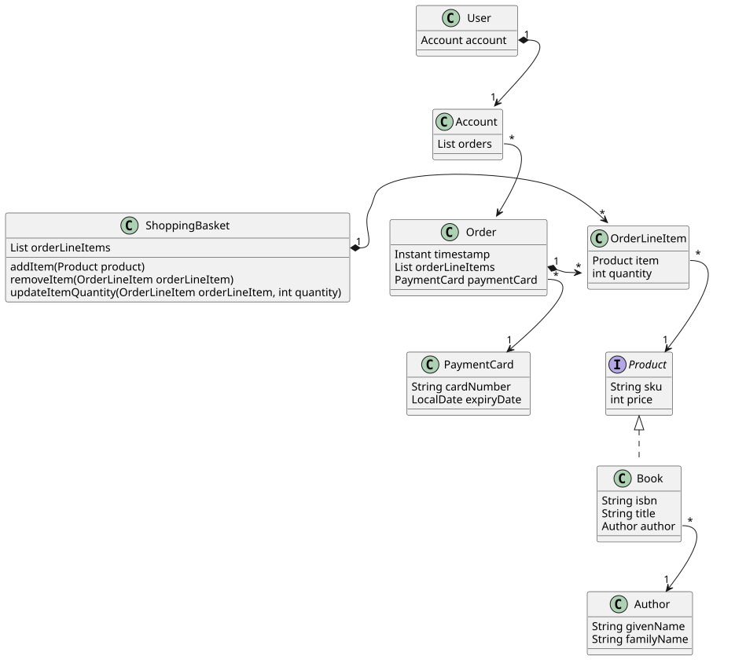

# Book Shop Domain Model

The Book Shop Domain Model is an attempt to capture details of and relationships
between the entities and concepts that are related to a book shop. The model
should remain separate from any implementation technology, but instead model
the ideas that remain constant regardless of an implementation approach.

The model also serves to help identify a
[ubiquitous language](https://martinfowler.com/bliki/UbiquitousLanguage.html)
that should be used consistently throughout documentation of the Book Shop app.

