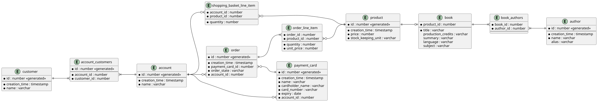

# Book Shop Data Persistence

The Book Shop site will use multiple persistence technologies as required for
it various data storage and retrieval requirements.

## Relational Database

For handling transactional processing, a traditional relational database such as
[PostgreSQL](https://www.postgresql.org/) is appropriate. As such, user
accounts, orders, and book details need to be represented in a relational
schema.

## Search Engine

For free-text searches of books, authors, etc. a search engine such as
[Elasticsearch](https://www.elastic.co/elasticsearch) is appropriate.

The document object model for a book will be based on a flattened superset of
the fields for a book, its product, and associated authors.

While the book document will be useful as a means to index books for searching,
the details of matched books will be taken from the relational schema.
