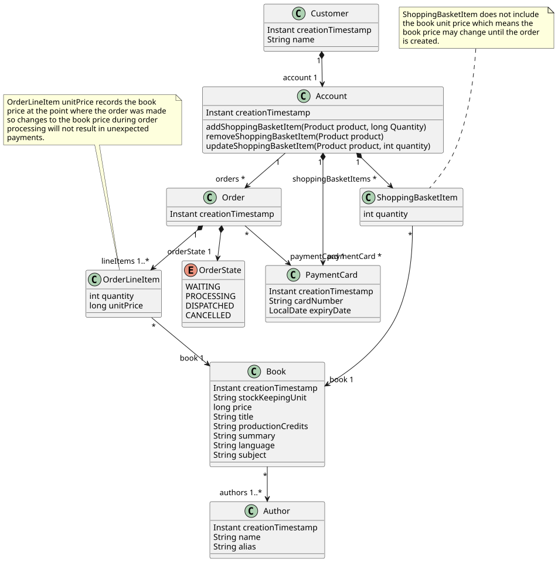
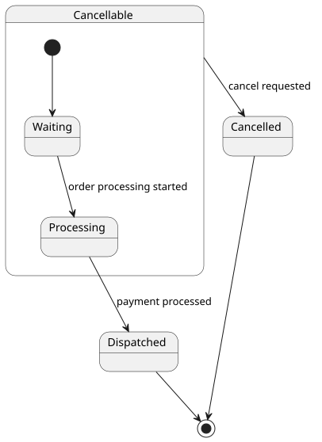

# Book Shop Domain Model

The Book Shop Domain Model is an attempt to capture details of and relationships
between the entities and concepts that are related to a book shop. The model
should remain separate from any implementation technology, but instead model
the ideas that remain constant regardless of an implementation approach.

The model also serves to help identify a
[ubiquitous language](https://martinfowler.com/bliki/UbiquitousLanguage.html)
that should be used consistently throughout documentation of the Book Shop app.

##  Book

In a book shop, one of the things that needs to be present is a book. In our
case the book model is starting out heavily influenced by the structure of the
[Project Gutenberg Offline Catalog](https://www.gutenberg.org/ebooks/offline_catalogs.html)
as this representative of actual books, an serves as a useful test dataset of
over 75,000 books and authors.

As such, a _Book_ has a mandatory _title_, and then all other fields are
optional.
The _language_ field is actually an international language code such as `en`.

## Author

_Author_ has a mandatory _name_ field, which will contain the author's full
name.
The optional _alias_ field allows for an alternative representation of the
author's name.
The optional _birthdate_ field may be used to store the author's date of birth.

## Product

Book shops will often branch out into other literary adjacent items such as
[tiny mugs](https://www.theliterarygiftcompany.com/products/go-away-im-reading-bone-china-mug),
[inspiring bags](https://www.bookishly.co.uk/collections/literary-bookish-tote-bags),
or [snacks](https://www.amazon.com/review/RZFIYJTPVUZ94).

As such, a book is considered to be a type of _Product_ for the purposes of
making purchases. This leaves room for non-book products to be added at a
future date.

Each _Product_ has a
[_stockKeepingUnit_ or SKU](https://en.wikipedia.org/wiki/Stock_keeping_unit)
value, which is the unique product code. It also has a _price_ which, at least
to begin with, is simply represented as a value in pennies.

## Shopping Basket

In order for a potential customer to make a purchase, they must first add items
to their _Shopping Basket_.

## Order Line Item

In a shopping basket each _Product_ has an associated quantity (so that you can buy ten of the same book without it appearing ten times) so the
_Shopping Basket_ ten separate times. The combination of a product and quantity
is represented as an _Order Line Item_
([which is not a new idea](https://mirkwood.cs.edinboro.edu/~bennett/class/csci313/spring2013/notes/six/three.html)).

## Order

The customer, having prepared their _Shopping Basket_ with items that they wish
to purchase, can convert the basket contents into an _Order_ by purchasing them.
Once payment has been authorized an _Order_ is created, the _Shopping Basket_
reset to an empty state, and the order delivery process begins.

The order has a creation time, and a state to indicate where it is in the order
processing workflow.

### Order State

An order starts out in the _Waiting_ state. Once preparation of the order has
started it enters the _Processing_ state, where it remains until it is ready for
dispatch and payment is taken. When payment is taken it enters the _Dispatched_
state where it is sent to the customer.

At any time up to the _Dispatched_ state the customer may request to cancel the
order, at which point it will transition to the _Cancelled_ state. Once
cancelled, no payment will be taken and any processing will be reverted.

## Payment Card

The bookshop, if it existed, would be a cashless business. Each order would
therefore have details of a _Payment Card_ from which to take payment
immediately prior to dispatch.

## Account

An _Account_ holds details of _Payment Cards_ and _Order_ histories. At some
future point there may be support for accounts to which multiple users have
access, or conversely support for users to have multiple accounts, so _Account_
is represented as a separate entity to a customer.

## Customer

A _customer_ represents an actual person who us able to authenticate with the system
and interact with it. They have a name, which is not necessarily unique, and an
associated _Account_.
