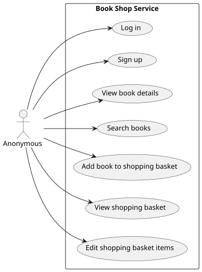
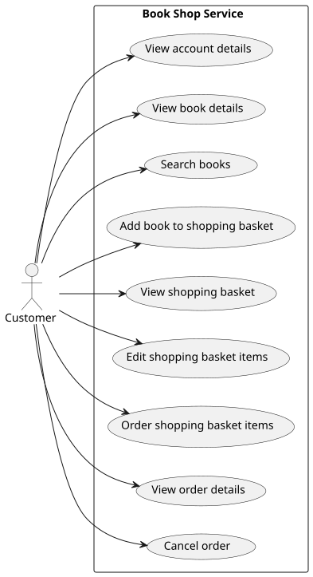
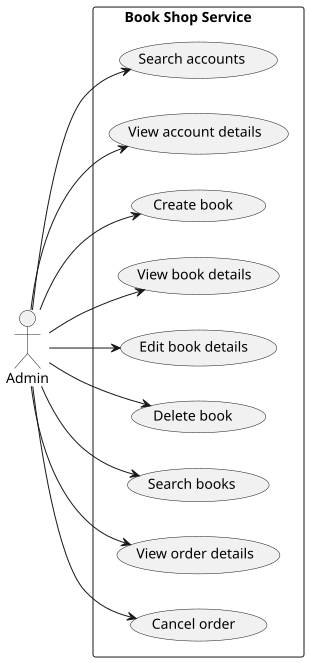

# Book Shop Use Cases

The sections below show an overview of the use cases identified for the Book
Shop application.

## Actors

The main separate roles for interations with the system are as follows:

### Anonymous

The Anonymous actor represents a customer who is viewing the site without having
signed into an account. They will be able to see products and even add them to
a shopping basket, but will not be able to create an order from their shopping
basket items until they have created a customer account and signed in.

### Customer

The Customer actor represents someone who has signed into the site in order to
purchase books. They can provide payment details to order the items in their
shopping basket. Orders are recorded on the customer's account and can be viewed
and, depending on the order state, cancelled.

### Admin

The Admin customer is able to modify the set of and details of books available. They
can view the accounts of any customer and cancel customer orders.
